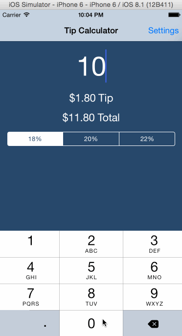

# iOS Tip Calculator built in Swift

[](https://travis-ci.org/drn/codepath-tips)
[](https://circleci.com/gh/drn/codepath-tips) - **Note: Circle-CI doesn't yet support Cocoapods Beta**

Swift Codepath Course Prework

## Background

This simple Swift iOS app provides an easy way to calculate tip.

## Walthrough



## QA

* How many hours did it take to complete?
  * ~6 hours in total
* Which required and optional stories have you completed?
  * Basic tip calculator
  * Settings page
    * NSUserDefaults-persisted tip percentage configuration
    * KVO of settings
  * UI animations (as seen in walkthrough gif)
  * Implemented specs via the Quick testing framework

## Tests

Dependencies can be installed with:
```
gem install cocoapods --pre
pod install
```

Tests can be run with:
```
rake test
```

## Dependencies Used

* [Quick](https://github.com/Quick/Quick)

## License

This project is licensed under the [MIT License](http://opensource.org/licenses/MIT)
